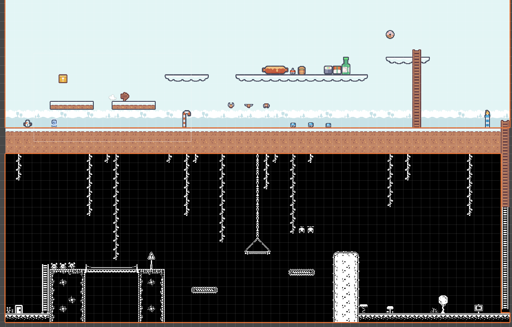

# Introduction to Game Development - Assignment 1 Part 2

We were tasked with constructing a simple, 2D platformer environment; a "hello, world!" program in Unity.

Note: this project features liberal use of assets from [kenney.nl](kenney.nl). Namely, the spritesheets contained in the following asset packs:

- [Pixel platformer](https://www.kenney.nl/assets/pixel-platformer)
- [Pixel platformer: food expansion](https://www.kenney.nl/assets/pixel-platformer-food-expansion)
- [1-bit platformer](https://www.kenney.nl/assets/1-bit-platformer-pack) 

Please note that, at the time of creating this repository, these assets had been made available under the [CC0 license](https://creativecommons.org/public-domain/cc0/).

### Preview

